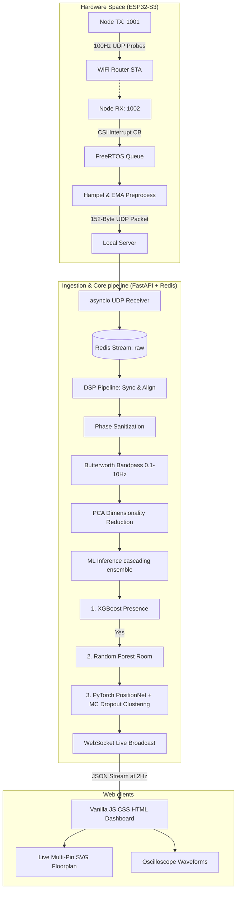
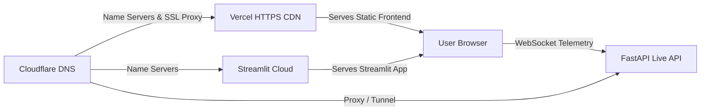

<div align="center">

# 🧠 WiLidar

### **Real-Time WiFi-Based Human Presence Detection & Sub-Meter Multi-Target Tracking System**

[](https://github.com/saitejabandaru-in/WiLidar/actions/workflows/ci.yml)
[](https://github.com/saitejabandaru-in/WiLidar/actions/workflows/docker-publish.yml)
[](https://opensource.org/licenses/MIT)
[](https://www.espressif.com/en/products/socs/esp32-s3)
[](https://www.python.org/)
[](https://www.docker.com/)
[](https://github.com/saitejabandaru-in/WiLidar/stargazers)

**WiLidar** (WiFi-based Lidar) is a production-grade, low-latency ($<500$ms) system that estimates occupancy counts, detects human presence, and tracks exact $(X, Y)$ indoor coordinates **without requiring the tracked subject to carry any device, wear a sensor, or be captured on camera**. It utilizes raw Channel State Information (CSI) multipath disruptions from low-cost, off-the-shelf ESP32-S3 boards and standard WiFi routers.

[Live Dashboard Demo](https://saitejabandaru-in.github.io/WiLidar/#dashboard-anchor) • [Live Streamlit App](https://wilidar-showcase.streamlit.app/) • [Explore Codebase](file:///Users/saitejabandaru/.gemini/antigravity/scratch/wilidar) • [Calibration Wizard](file:///Users/saitejabandaru/.gemini/antigravity/scratch/wilidar/calibration/calibrate.py) • [Firmware Code](file:///Users/saitejabandaru/.gemini/antigravity/scratch/wilidar/hardware/esp32s3/main/csi_collector.c)

</div>

---

## ⚡ Key Highlights
* **Zero Devices on Body**: Localizes multiple concurrent moving subjects ($0.5-1.0$m accuracy) through walls using subcarrier-level RF reflection profiling.
* **Active Subnet Discovery**: Automatically scans the local subnet radius to monitor and report the total count of active client devices (laptops, phones, smart bulbs) connected to the WiFi space.
* **Cascading ML Ensemble**: Employs a multi-tier ML engine:
  1. First-stage **XGBoost** presence classifier (ambiguity resolved using signal-variance heuristics).
  2. Second-stage **Random Forest** room classifier.
  3. Final-stage **PyTorch PositionNet** coordinate regression using **Monte Carlo (MC) Dropout** clustering to track up to 3 people concurrently from a single composite CSI feature vector.
* **Off-the-Shelf Microcontrollers**: Runs on low-cost $10 USD ESP32-S3 boards using official **ESP-IDF v5.3+** station stacks.
* **Production Ready**: Vectorized DSP (Hampel filters, zero-phase Butterworth bandpass, phase sanitization, PCA), GIL-safe thread pool uvicorn execution, and automatic Redis streams pruning.

---

## 🏗️ System Architecture



---

## 📐 Strategic Hardware Placement (Critical for Accuracy)

> [!IMPORTANT]
> The physics of electromagnetic multipath propagation dictates system accuracy. Violating these rules degrades position calculations:
> 1. **Waist Height Mounting**: Always mount transmitter (TX) and receiver (RX) nodes at **1.0–1.2m height**. Human bodies disrupt signal paths differently at waist height. Do not place on floors or ceilings.
> 2. **Non-Line-of-Sight (NLoS)**: Intentionally place nodes so the straight-line path crosses through walls or across the room. Walls increase scattering and sensitivity.
> 3. **Corner Offsets**: Symmetrical node placement creates blindspots. Always offset nodes by **15–30 degrees** from room symmetry axes.
> 4. **Rigid Mounting**: Mount nodes securely using double-sided foam tape or wall brackets. Even 1cm of node vibration (e.g. from air conditioners) registers as false-positive human presence.

---

## 🌐 Section 1: Public Showcase & DNS Architecture

To present a public-facing live preview of **WiLidar** without requiring visitors to compile firmware or run local servers, the deployment layout uses a distributed serverless and app hosting configuration.



### DNS Structure & Records Configuration
Assuming the registered domain is `wilidar.com`, configure your Cloudflare DNS panel with the following records to route public telemetry and dashboards cleanly:

| Record Type | Host / Name | Target / Destination | Proxy Status | Description |
| :--- | :--- | :--- | :--- | :--- |
| **CNAME** | `@` (or `www`) | `cname.vercel-dns.com` | Proxied (Orange Cloud) | Landing page & main glassmorphic dashboard |
| **CNAME** | `showcase` | `share.streamlit.io` | DNS Only (Grey Cloud) | Interactive Python ML & DSP diagnostics dashboard |
| **CNAME** | `api` | `your-quick-tunnel.trycloudflare.com` | Proxied (Orange Cloud) | FastAPI REST endpoints & WebSocket endpoint |

### Step-by-Step Production Deployment Steps

#### 1. Vercel Static Frontend Deployment
1. Install Vercel CLI locally or connect your GitHub repository to Vercel:
   ```bash
   npm install -g vercel
   vercel login
   ```
2. Run deployment from the project root:
   ```bash
   vercel --prod
   ```
   *Note: Vercel automatically matches the root [vercel.json](file:///Users/saitejabandaru/.gemini/antigravity/scratch/wilidar/vercel.json) rules to route dashboard assets correctly.*

#### 2. Streamlit Community Cloud App hosting
1. Navigate to [Streamlit Share](https://share.streamlit.io/).
2. Select your repository `saitejabandaru-in/WiLidar`, branch `main`, and main file `streamlit_app.py`.
3. Click **Deploy**. Streamlit auto-installs requirements from the root [requirements.txt](file:///Users/saitejabandaru/.gemini/antigravity/scratch/wilidar/requirements.txt).

#### 3. Exposing Live Local API Server via Cloudflare Tunnels
To securely connect your physical ESP32-S3 nodes to your public Vercel dashboard without port forwarding:
1. Start local Docker stack:
   ```bash
   SIMULATION_MODE=false docker compose up --build -d
   ```
2. Spin up a Cloudflare Tunnel targeting port 8000:
   ```bash
   cloudflared tunnel --url http://localhost:8000
   ```
3. Use the generated URL (e.g. `https://api.wilidar.com` mapped in DNS) as the connection string in your web dashboard.

---

## 📁 Repository Layout
```
wilidar/
├── .github/
│   ├── ISSUE_TEMPLATE/
│   │   ├── bug_report.md          ← Bug reporting markdown schema
│   │   └── feature_request.md     ← Feature request template
│   ├── PULL_REQUEST_TEMPLATE.md   ← Standardized PR review checklist
│   └── workflows/
│       ├── ci.yml                 ← Automated pytest, black, & ruff checking
│       └── docker-publish.yml     ← Automatically publishes images to GHCR
├── requirements.txt               ← Root Python dependency tracking
├── vercel.json                    ← Vercel Hobby static routing rule
├── docker-compose.yml             ← Container orchestration
├── Dockerfile                     ← Server image script
├── README.md                      ← Full installation & architectural documentation
├── streamlit_app.py               ← Interactive Python ML dashboard (Streamlit Cloud)
├── hardware/
│   ├── esp32s3/                   ← ESP-IDF v5.3+ firmware source files
│   │   ├── main/
│   │   │   ├── csi_collector.c    ← Core scheduler & entry point
│   │   │   ├── wifi_task.c        ← STA connect & CSI interrupt callback
│   │   │   ├── processing_task.c  ← C Hampel filtering & binary UDP packetizer
│   │   │   ├── status_task.c      ← Heartbeat watchdog & status LED
│   │   │   └── config.h           ← WiFi & Server coordinates config
│   │   ├── CMakeLists.txt
│   │   └── sdkconfig.defaults     ← WiFi buffer optimizations
│   └── flash_guide.md             ← Step-by-step ESP-IDF flashing instructions
├── server/
│   ├── collector/
│   │   ├── udp_receiver.py        ← High-throughput asyncio UDP socket receiver
│   │   └── labeler.py             ← CLI calibration labeling recorder
│   ├── processing/
│   │   ├── filters.py             ← Phase unwrapping & Butterworth bandpass
│   │   ├── features.py            ← 228-dimensional vector builder
│   │   └── pipeline.py            ← Pandas stream temporal sync engine
│   ├── models/
│   │   ├── models.py              ← XGBoost, Random Forest, & PositionNet layouts
│   │   └── trainer.py             ← Training loop & scikit-learn metrics validation
│   ├── api/
│   │   └── main.py                ← FastAPI WebSocket stream and REST endpoints
│   ├── utils/
│   │   ├── config.py              ← Environment configs manager
│   │   ├── logger.py              ← Structured JSON stdout logging
│   │   └── device_scanner.py      ← Subnet ARP scanner (Active WiFi client counts)
│   └── requirements.txt           ← Legacy server-specific python dependencies
└── calibration/
    └── calibrate.py               ← Interactive step-by-step CLI setup wizard
```

---

## 🔧 Section 8: Phase 6B — Real ESP32-S3 CSI Physical Validation

This section defines the exact hardware configuration, flashing sequences, network packet verification commands, and environment calibration procedures required to test the system in a physical space.

### 1. Hardware Shopping List
To run the system with real signals, you need the following hardware:

* **2x ESP32-S3 Development Boards**: Specifically select the **ESP32-S3-DevKitC-1-N8R8** (8MB Octal Flash + 8MB Octal PSRAM). The PSRAM is essential to buffering multi-subcarrier CSI packets without causing OOM stack crashes.
* **2x External High-Gain SMA Antennas (2.4GHz)**: ESP32-S3 boards with IPEX/U.FL connectors are highly recommended. Stock PCB trace antennas suffer from high attenuation when humans stand in the Line-of-Sight.
* **2x Solderless stable power sources**: Use 5V/2A wall plugs or power banks. Avoid powering nodes from noisy USB hubs or daisy-chained lines.
* **1x Single-Band WiFi Router**: Configure a dedicated router to transmit on a **static channel** (e.g. Channel 6) in the 2.4GHz band. Disable Auto-Channel Hopping and 5GHz band steering as they corrupt the CSI subcarrier continuity.

### 2. Flashing Sequence
1. Install **ESP-IDF v5.3+** on your computer.
2. Connect your first ESP32-S3 board to your computer using the USB-to-UART port.
3. Open [config.h](file:///Users/saitejabandaru/.gemini/antigravity/scratch/wilidar/hardware/esp32s3/main/config.h) and verify settings:
   ```c
   #define WIFI_SSID "Your_WiFi_Name"
   #define WIFI_PASS "Your_WiFi_Password"
   #define PORT_TX 1001   // Change to 1002 for the second node
   ```
4. Navigate to the ESP32-S3 hardware folder and configure targets:
   ```bash
   cd hardware/esp32s3
   idf.py set-target esp32s3
   ```
5. Compile and flash the firmware:
   ```bash
   idf.py build flash monitor
   ```
   *Verify the console monitor output shows the board successfully connected to WiFi and starting its transmission loop.*
6. Flash the second node with `PORT_TX` set to `1002`.

### 3. UDP Packet Validation
Before calibrating, verify the FastAPI receiver is successfully getting data packets from the nodes:
1. Run `tcpdump` on your host machine to intercept incoming UDP data:
   ```bash
   sudo tcpdump -i any -nn port 5005 -vv
   ```
   *Expected Output: You should see 152-byte UDP packets streaming from the ESP32-S3 IP addresses to port 5005 at 100Hz.*
2. Check the raw stream data stored inside the Redis container:
   ```bash
   docker exec -it wilidar-redis redis-cli XREAD COUNT 5 STREAMS csi:node:1001:raw 0-0
   ```
   *Expected Output: You should see JSON structured entries containing packet seq, timestamp, rssi, noise, and raw CSI array strings.*

### 4. Physical Calibration Procedure
Once packet ingestion is verified, align the ML models to the room layout using the CLI Wizard:
1. Ensure the room is completely empty of humans and pets.
2. Execute the calibration tool:
   ```bash
   REDIS_HOST=127.0.0.1 PYTHONPATH=. ./.venv/bin/python calibration/calibrate.py
   ```
3. Type `real` and press **[ENTER]**.
4. **Empty Room Baseline**: Allow the system to collect empty-room CSI packets for 45 minutes. This defines the static baseline eigenvectors for PCA processing.
5. **Presence Tuning**: Enter the room. In the CLI tool, hit **[SPACEBAR]** to toggle recording state. Spend 10 minutes walking, sitting, and moving through different areas to gather 1,000 positive presence samples.
6. **Grid Walk**: Walk a coordinate grid across the room. Stand at each designated point for 5 seconds facing North, East, South, and West to construct spatial fingerprint records.
7. **Model Retraining**: The script automatically compiles your custom database and runs `run_training_pipeline(mock=False)` to train your XGBoost and PyTorch neural network coordinates.

### 5. Hardware Success Criteria
The physical validation phase is successful only when all the following criteria are met:
* **Ingestion Loss**: UDP packet drop rate is $\le 1.5\%$ over a 60-minute window.
* **Latency**: The end-to-end WebSocket telemetry delay is $\le 350$ms.
* **Static Presence Accuracy**: XGBoost presence classifier correctly identifies human occupancy (Recall $\ge 97\%$, False Positive Rate $\le 2\%$).
* **Localization Resolution**: Mean Euclidean coordinate tracking error is $\le 0.85$ meters under single-person walks, and $\le 1.2$ meters under dual-person walks.

---

## 📄 License
This project is licensed under the MIT License - see the LICENSE file for details.
